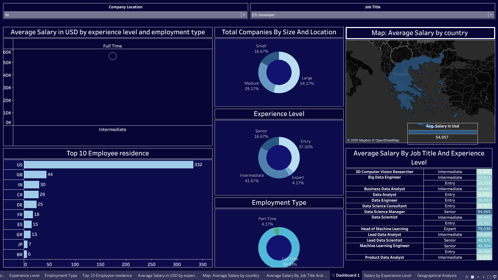
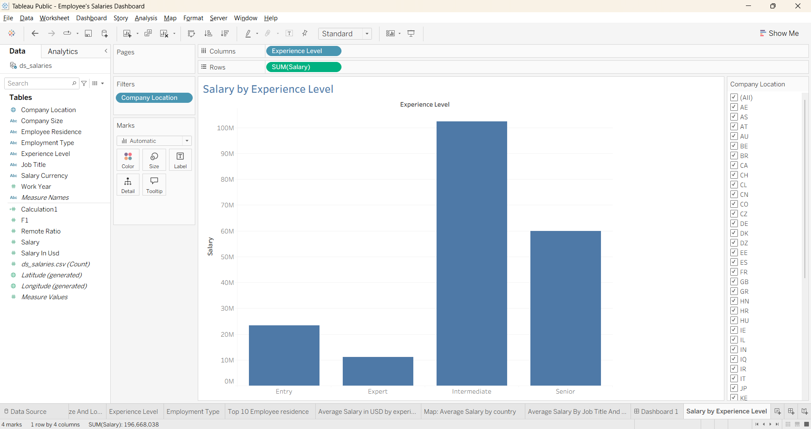
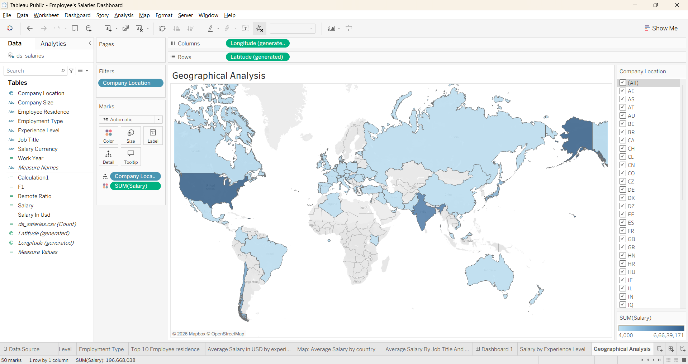

# 📊 Data Science Salaries Dashboard (Tableau Project)

> Interactive Tableau dashboard analyzing global Data Science salaries across experience levels, roles, company sizes, and locations.

---

## 📌 Project Overview

This project presents an interactive Tableau dashboard built using the **Data Science Salaries dataset** from Kaggle.  

The objective of this project is to analyze compensation trends in the global Data Science industry and explore how salary varies based on:

- Experience Level  
- Job Role  
- Employment Type  
- Company Size  
- Remote Work Ratio  
- Geographic Location  

The dashboard enables dynamic filtering and visual exploration of salary distribution patterns.

------------------------------------------------------------------------

## 📂 Repository Contents

-   ds_salaries.csv\
-   Employee's Salaries Dashboard.twbx\
-   README.md
-   Dashboard_Overview\
-   Geographical_Analysis\
-   Salary_By_Experience_Level\

------------------------------------------------------------------------


---

## 📊 Dataset Information

**Dataset Name:** Data Science Job Salaries  
**Source:** https://www.kaggle.com/datasets/ajjarvis/ds-salaries  
**Format:** CSV  

The dataset contains structured salary information for Data Science professionals worldwide.

### Key Features:

- `work_year`
- `experience_level`
- `employment_type`
- `job_title`
- `salary`
- `salary_currency`
- `salary_in_usd`
- `employee_residence`
- `remote_ratio`
- `company_location`
- `company_size`

This dataset allows exploration of compensation patterns across different professional and geographic factors.

-------------------------------------------------------------------------------

## 📈 Tableau Dashboard

The Tableau Packaged Workbook (`Employee's Salaries Dashboard.twbx`) includes:

- Salary distribution analysis
- Experience-level comparison
- Job role salary comparison
- Geographic salary insights
- Remote work impact visualization
- Company size vs salary patterns

The dashboard is interactive and allows filtering by role, experience, and location to explore trends dynamically.

### 🔧 How to Open

1. Install **Tableau Desktop**
2. Open: **Employee's Salaries Dashboard.twbx**
------------------------------------------------------------------------------

## 🛠 Tools & Technologies Used

-   Tableau Desktop\
-   CSV Dataset\
-   Data Visualization Techniques\
-   Exploratory Data Analysis (EDA)

------------------------------------------------------------------------

## 🚀 How to Use

1.  Clone the repository:

    ``` bash
    git clone https://github.com/DeepDobariya307/Visual_Analytics_DS_Employee's_Dashboard.git
    ```

2.  Open the .twbx file using Tableau Desktop.

3.  Explore the interactive dashboard and filters.

3. Use filters and interactive elements to explore insights.

------------------------------------------------------------------------------------

## 📸 Dashboard Screenshots

### 🔹 Dashboard Overview


### 🔹 Salary by Experience Level


### 🔹 Geographic Salary Distribution


-----------------------------------------------------------------------------------

## 🔍 Key Analytical Questions

This project explores:

- How does experience level impact salary distribution?
- Which job roles offer the highest median salary?
- Does remote work influence compensation levels?
- How does company size correlate with salary?
- Which countries show the highest salary concentration?

-------------------------------------------------------------------------------------

## 🛠 Tools & Technologies Used

- Tableau Desktop
- CSV Dataset
- Data Visualization Techniques
- Exploratory Data Analysis (EDA)

-------------------------------------------------------------------------------------

## 🎯 Learning Outcomes

Through this project:

- Built interactive analytical dashboards
- Applied visualization best practices
- Explored salary trends in the global data industry
- Transformed raw data into actionable insights

-------------------------------------------------------------------------------------

## 👤 Author

Deep Dobariya  
M.Sc. Artificial Intelligence  
Brandenburg University of Technology Cottbus–Senftenberg  

-------------------------------------------------------------------------------------

## 📜 License

This project is for academic and educational purposes.  
Dataset credit belongs to the original Kaggle contributor.

------------------------------------------------------------------------

